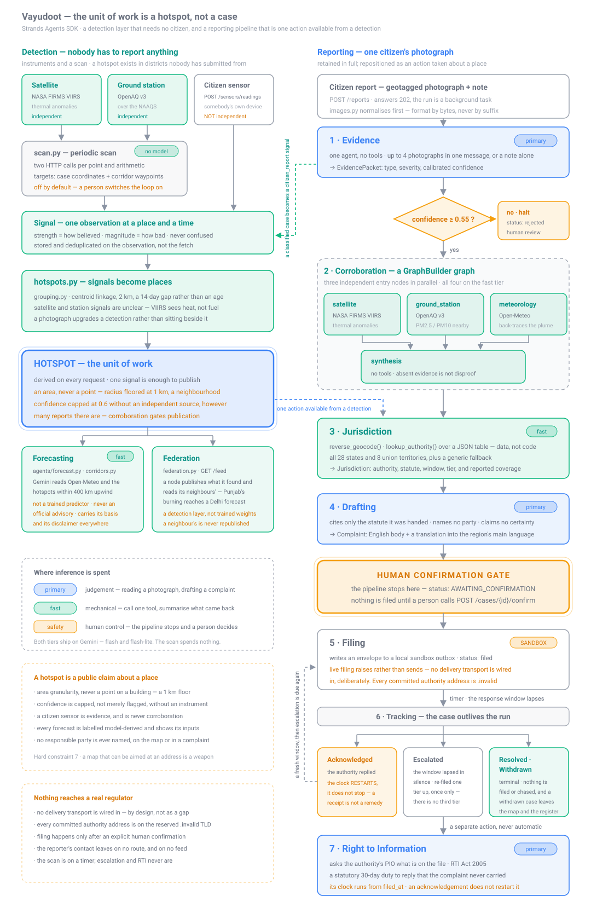

# Architecture

## Why this shape

The work being automated is a sequence with one genuine fan-out in the middle.
Classification must happen before corroboration, because you cannot corroborate a
report until you know what is being claimed. Jurisdiction must be resolved before
drafting, because the statute cited depends on the authority. Those are real
dependencies, so those stages are a pipeline.

Corroboration is different. Satellite thermal detections, ground station readings,
and meteorological conditions are independent of one another, and none needs the
others' output. That is a real fan-out, so it is a Strands agent graph with three
entry points converging on a synthesis node. Using a graph for the whole system
would have been decoration; using one here is the shape of the problem.

## Stages

### 0. Intake — `images.py`

Not an agent, and it runs before the pipeline does. Model content blocks accept
four image formats; phones do not restrict themselves to four. iOS produces HEIC
by default, and people upload TIFF, BMP, and screenshots in whatever the tool
emitted.

The format is decided by decoding the bytes, never by the file extension. That
also means the supported set is "whatever Pillow reads" — roughly seventy
formats, AVIF and HEIC included — rather than a list kept here. A list would need
amending every time a phone vendor changed its default, which is how the bug
below happened in the first place. That
distinction was a real bug rather than a hypothetical one: an unrecognised suffix
used to be rewritten to `.jpg`, so HEIC bytes reached the model labelled as JPEG
and it saw nothing, silently, with the case proceeding as though a photograph had
been read.

Normalising also does two things the classification depends on. It applies EXIF
rotation to the pixels, because a model reads pixels and not the orientation tag,
so a portrait phone photograph would otherwise arrive on its side. And it caps
the longest edge at 1568 pixels: a 12 megapixel photograph carries far more
detail than a classification uses, and every pixel above that is tokens spent for
nothing, which matters when inference is the only running cost. An image that is
already acceptable, upright and small enough passes through byte for byte rather
than being re-encoded.

Unreadable bytes are a `415` at the API boundary. Failing at the door gives the
citizen something to act on; failing at the model gives them a case that dies
four seconds later for no visible reason.

### 1. Evidence — `agents/evidence.py`

A single agent with no tools. The photograph is passed as a Strands image content
block and the agent returns an `EvidencePacket` through structured output.

The prompt pushes toward conservatism, and the pipeline enforces a confidence
floor of 0.55. Below it, the case halts with status `rejected` and a note asking
for human review. This matters because the output of this stage becomes a formal
complaint against a real party.

### 2. Corroboration — `agents/corroboration.py`

A `GraphBuilder` graph, three parallel entry points into one synthesis node.

| Node | Tool | Source |
| --- | --- | --- |
| `satellite` | `find_satellite_fire_detections` | NASA FIRMS VIIRS |
| `ground_station` | `get_nearby_air_quality` | OpenAQ v3 |
| `meteorology` | `get_wind_conditions` | Open-Meteo |
| `synthesis` | none | joins the three, returns `Corroboration` |

The meteorology tool also back-traces the plume. Meteorological wind direction is
the bearing the wind blows *from*, so anything carried to the report location
originated along that same bearing; the tool projects two kilometres along it and
returns a candidate source coordinate.

The synthesis prompt is explicit that absent evidence is not disproof. Hyper-local
events routinely fall below satellite resolution and happen far from the nearest
monitoring station — which is the exact gap this project exists to close, so
treating silence as a negative would defeat the purpose.

### 3. Jurisdiction — `agents/jurisdiction.py`

An agent with two tools: reverse geocoding, then a lookup against a data-driven
authority table keyed by administrative region and pollution category.

The table is JSON, not code. Pointing the system at another state or another
country is a data change. The prompt forbids inventing an authority, an address,
or a statute section.

**Coverage is reported, not assumed.** A fixed table has edges, and the failure
at those edges used to be silent: if a category called for a municipal body and
the city was not listed, the lookup quietly returned the state board and relabelled
the tier, so a substitution was indistinguishable from a match. The tool now
returns `coverage` — `exact`, `fallback`, or `generic` — with a note explaining
it, the agent copies both into the `Jurisdiction`, and the case shows a warning
for anything other than `exact`.

Asking the agent to report its own accuracy is only worth so much, so the
pipeline checks the one thing that can be checked deterministically: an address
that exists only in the generic fallback entry means the region was absent,
whatever the model said. `GET /authorities` publishes the whole table, and the
interface has a Coverage tab, so the limit is visible before a citizen submits
rather than after.

### 4. Drafting — `agents/drafting.py`

A single agent, structured output to `Complaint`. It receives the evidence, the
corroboration, and the jurisdiction, and is instructed to cite only the statute
supplied to it. It produces an English body and a translation into the region's
main language.

The prompt forbids exaggeration, naming an accused party, and claiming certainty
beyond the evidence — all three of which get complaints dismissed.

### 5. Filing and escalation — `filing.py`

Filing writes an envelope to a local sandbox outbox. Live filing raises rather
than sends. Escalation compares the filing timestamp against the statutory
response window carried on the `Jurisdiction` object and re-files to the
escalation authority when it lapses.

### 6. Interface and HTTP surface — `api.py`, `web/`

A full run is minutes of model calls, which no browser will wait through on a
form submission. So `POST /reports` writes the case to disk, starts the pipeline
as a background task, and answers `202` with a case id. The page then polls
`GET /cases/{id}` and renders whatever has landed.

That is why a case carries two fields rather than one. `status` is the case's
legal lifecycle — `awaiting_confirmation`, `filed`, `escalated`, `rejected`.
`stage` is how far the machinery has got — `received`, `evidence`,
`corroboration`, `jurisdiction`, `drafting`, `complete`, `halted`. A case is
`draft` for the whole run; without `stage` there would be nothing to show during
it.

The pipeline saves after every stage for the same reason: partial state has to be
readable from disk the moment it exists, not at the end. A stage that raises is
caught, and the case is left as `failed` with the exception recorded on it and
`stage` parked on whatever was running when it died — a run that dies must leave
a readable case rather than a 500 and no trace.

The interface is static files served by the same process — a Preact app in
native ES modules, with the runtime vendored under `web/vendor/` so there is no
build step and no CDN in the request path. One deployment, one URL, no CORS. It
is mounted last so it cannot shadow an API route. Two
endpoints exist purely for it: `/cases/{id}/photo`, which serves the submitted
photograph and refuses any path that does not resolve inside the uploads
directory, and `/cases/{id}/envelope`, which returns the filed envelope exactly
as it was written to the sandbox outbox — the point of the demo is that you can
read what would have been sent.

## State

`Case` is the single object that accumulates across stages, holding the report,
every intermediate result, a status, a stage, any error, and an append-only
history. It is persisted as JSON by `store.py` because a case outlives the
request that created it: a complaint filed today is chased for weeks. Replacing `store.py` with Postgres
touches no other module.

## Provider abstraction

`models.build_model()` is the only place a provider is constructed. This exists so
that the same agent code runs on Gemini or Ollama unchanged, which is the point
of the Strands provider abstraction and also what keeps the Google-hosted
deployment path open without a rewrite.

## Deliberate omissions in the prototype

- No delivery transport. This is a safety property, not a gap.
- JSON file storage rather than a database.
- The authority table covers 24 states and union territories plus a generic
  fallback. Adding another is a JSON edit.
- No authentication on the API.
